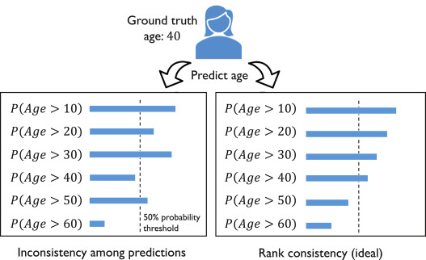

**CORAL implementation for ordinal regression with deep neural networks.**


[](https://travis-ci.com/rasbt/coral_pytorch)
[](https://pypi.org/project/coral_pytorc/)
[](https://github.com/rasbt/coral_pytorch/blob/master/LICENSE)


<br>

**Documentation: [https://rasbt.github.io/coral_pytorch](https://rasbt.github.io/coral_pytorch)**

---

## About  

CORAL, short for COnsistent RAnk Logits, is a method for ordinal regression with deep neural networks, which addresses the rank inconsistency issue of other ordinal regression frameworks.



Originally, developed this method in the context of age prediction from face images. Our approach was evaluated on several face image datasets for age prediction using ResNet-34, but it is compatible with other state-of-the-art deep neural networks.

This repository implements the CORAL functionality (neural network layer, loss function, and dataset utilities) for convenient use. Examples are provided via the "Tutorials" that can be found on the documentation website at [https://rasbt.github.io/coral_pytorch](https://rasbt.github.io/coral_pytorch).

If you are looking for the orginal implementation, training datasets, and training log files corresponding to the paper, you can find these here: [https://github.com/Raschka-research-group/coral-cnn](https://github.com/Raschka-research-group/coral-cnn).


---

## Cite as

If you use BioPandas as part of your workflow in a scientific publication, please consider citing the BioPandas repository with the following DOI:

- Wenzhi Cao, Vahid Mirjalili, and Sebastian Raschka (2020).  *Rank Consistent Ordinal Regression for Neural Networks with Application to Age Estimation*. Pattern Recognition Letters 140, pp. 325-331; [https://doi.org/10.1016/j.patrec.2020.11.008](https://doi.org/10.1016/j.patrec.2020.11.008).


```
@article{coral2020,
title = "Rank consistent ordinal regression for neural networks with application to age estimation",
journal = "Pattern Recognition Letters",
volume = "140",
pages = "325 - 331",
year = "2020",
issn = "0167-8655",
doi = "https://doi.org/10.1016/j.patrec.2020.11.008",
url = "http://www.sciencedirect.com/science/article/pii/S016786552030413X",
author = "Wenzhi Cao and Vahid Mirjalili and Sebastian Raschka",
keywords = "Deep learning, Ordinal regression, Convolutional neural networks, Age prediction, Machine learning, Biometrics"
}
```

